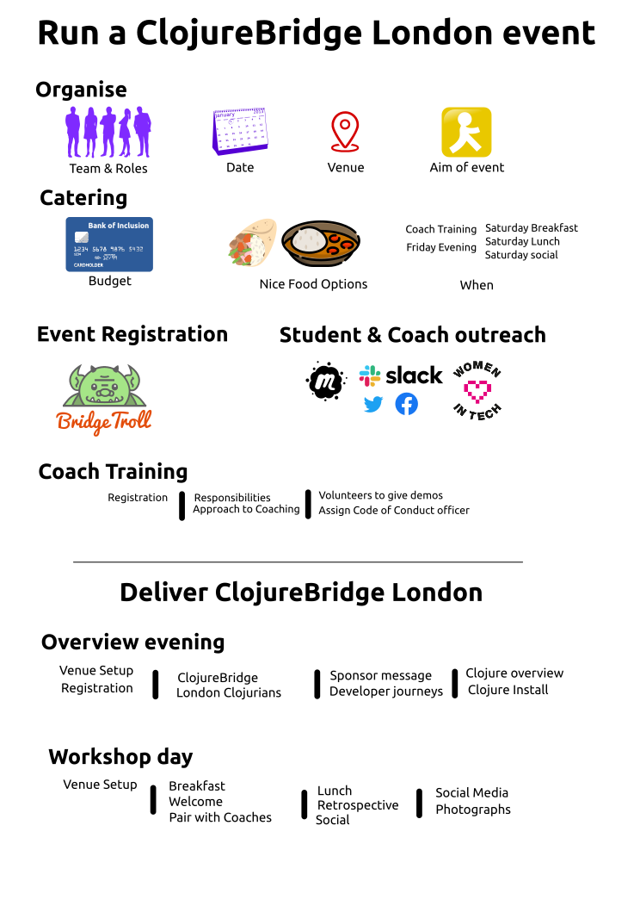

# How to run a ClojureBridge London Event

[ClojureBridge](http://www.clojurebridge.org/) aims to increase diversity within the Clojure community by offering free, beginner-friendly Clojure programming workshops for underrepresented groups in tech.

The [ClojureBridge London](https://clojurebridgelondon.github.io/) workshops have focused on women. Organizers are free to choose a different underrepresented group when planning a workshop. A workshop's description should state the group or groups for which the workshop is to be held.

ClojureBridge was started in 2014 and is part of [Bridge Foundry](http://bridgefoundry.org/). [All around the world](http://www.clojurebridge.org/) ClojureBridge workshops have been organised by people just like you.

Here is an overview of the steps required to run a [ClojureBridge London](https://clojurebridgelondon.github.io/) event.  The flow of the event is represented by an Infographic, followed by details of each task.

Further advice is available in[#clojurebridge-london channel in the Clojurians Slack community](https://clojurians.slack.com/messages/clojurebridge-london), [ClojureBridge London Twitter account](https://twitter.com/ClojureBridgeLN), or email the London ClojureBridge team:  "london at clojurebridge dot org".

## Infographic

## Roles to assign

There should be at a few people involved in organising a ClojureBridge London event, to help spread the work around.

At every ClojureBridge workshop someone needs to take responsibility for each of the following roles.  A person can take on more than one role, however each role does require an amount of work.

### Organiser

Runs the overall event and makes sure everything happens.  They are the public face of the event, so this person should preferably represent the community you are trying to reach.

Tasks are managed via a GitHub project and an organiser should delegate work but be ultimately responsible that the tasks get done.

### Host

Ensures access to the venue and provides all the services.  The host drives which dates the event can take place on as they should be fully aware of the venue availability.

### Sponsor

A sponsor provides some or all of the financial support for the event.

A sponsor can present a short overview of themselves at the Friday evening event.  Sponsors also get logos added to the ClojureBridge London website.

### Coaches Coach

Coaches the volunteer coaches about the event, code of conduct and how the event will work on the day.

### Coach

Supports the learning process during the workshop.  Helps install Clojure development tools if the student wishes.

Optionally you can have someone who promotes the event; however, it may be that everyone pitches in.  It's best to co-ordinate promoting the event, so you inform any specific communities you are trying to reach first and avoid spamming any communities.

# Venue & Host

Select a suitable venue and a host (person who works at the venue).  The host should preferably be one of the organisers.

A suitable venue should include:
* space for the number of students you like, each with a coach (10 students requires room for 20 people).
* a good WiFi network
* a large screen / projector for opening presentations (Friday evenings, optionally Saturday)
* tables, chairs, power sockets for each group
* separate space for breakfast, lunch
* sticky notes and pens for a retrospective
* female hygiene products available
* disabled access

# Budget

Typically, a ClojureBridge event can be catered for up to 50 people for £1,000, or conservatively with a budget of £750, broken down as follows:

* Volunteer training food & drinks: £150
* Friday & Saturday snacks & drinks such as crisps, fruit, small amounts of beer, wine: £150
* Friday install party dinner such as pizza, mini burritos etc.: £200-250
* Saturday breakfast such as bagels, porridge, fruit etc. & coffee: £150
* Saturday lunch such as bento boxes, hummus bowls, salads etc.: £250
* Saturday afternoon ClojureBridge branded cookies or cupcakes such as [crumbs and doilies](http://www.crumbsanddoilies.co.uk/): £75-100
* Inclusivity adjustments for those who need them (eg. childcare, live and/or closed captioning for videos, limited support with travel)
* Optional Saturday post-workshop social bar tab: £200-500
* Optional speaker honorarium, typically Amazon voucher or similar: £30-50 per speaker

Due to the likelihood of a few last minute dropouts, it's advisable to order food from a caterer that allows for last minute adjustments without charge, to avoid wastage.

This doesn't include venue or additional costs, so adjust your budget accordingly and contact [previous organisers](https://github.com/orgs/ClojureBridgeLondon/people) for more info.

# Sponsorship

Sponsors for the event can provide additional funds to cover the budget or provide content or services that support or complement the event.

Previous sponsors & hosts include:
* Functional Works
* Funding Circle
* Entrepreneur First
* 8th Light
* Skills Matter (Code Node)
* Signal Media
* uSwitch
* ThoughtWorks
* Style.com
* GDS

# Managing the event

Managing the event is made much easier by using a few simple tools. The current recommendations for managing the event is to do the following:

* Create a new event on BridgeTroll, for example [ClojureBridge London @ Functional Works May 2019](https://www.bridgetroll.org/events/471)
* Update the [ClojureBridge London website](https://clojurebridgelondon.github.io/) with event date, location and sponsor details
* Create (or copy) a new student event on Meetup.com, linking to BridgeTroll event - [example event](https://www.meetup.com/London-Clojurians/events/233369825/)

* [Optional] Create a ClojureBridge London issue in the ClojureBridge repo - [example issues on clojurebridge/Workshops repository](https://github.com/ClojureBridge/Workshops/issues)

Contact "london at clojurebridge dot org" for access to these accounts.

## Contacts & account access

Contact us at "london at clojurebridge dot org" or via the [#clojurebridge-london channel in the Clojurians Slack community](https://clojurians.slack.com/messages/clojurebridge-london), - ([create Slack community account](http://clojurians.net/))

An existing organiser can give you delegated access to the Twitter account via TweetDeck.

# Promoting the event

The [ClojureBridge London website](https://clojurebridgelondon.github.io/) has all the information about the event (or links to relevant content), so it can be used to promote the event too (along with the London Clojurians meetup.com site).

Women in Tech communities in London / UK to reach out tool
* [Women who Code meetup](http://www.meetup.com/Women-Who-Code-London/), [twitter](https://twitter.com/WWCLondon) and [website](https://www.womenwhocode.com/london). Get event added to their weekly newsletter.
* [Code First Girls](http://www.codefirstgirls.org.uk/)
* [Mums in Technology](http://www.meetup.com/Mums-in-Technology-child-friendly-coding-school/) - child friendly events

Transgender & non-binary communities
* [TransCode](http://trans-code.org/), [@trans_code](https://twitter.com/trans_code)

Other Women focused communities
* [Ladies of Code](https://www.ladiesofcode.com/)
* [Women in Tech](http://www.womenintechnology.org/)
* [Women in Technology (UK)](http://www.womenintechnology.co.uk/)
* [Tech UK Women](http://www.techuk.org/focus/programmes/women-in-tech)
* [Tech London Advocates](http://www.techlondonadvocates.org.uk/working-groups/working-groups-women-in-london-tech/)
* [Women of Silicon Roundabout](http://www.women-in-technology.com/)
* [Mums in Technology (startups)](http://mumsintechnology.co.uk/) & [twitter](https://twitter.com/MumsinTech)
* [Tech Mums](http://techmums.co/)
* [Circle Co](https://twitter.com/circleco_)

Other (non women-focused) channels
* [London Universities](http://www.london.ac.uk/colleges_institutes.html) (bear in mind ClojureBridge attendees must be 18+)
* [UoL Student Union](https://www.studentcentral.london/)
* [London Functional Programmers](https://www.meetup.com/London-Functionals/)

Internal channels:
* ClojureBridge [Twitter](https://twitter.com/ClojureBridgeLN) account
* [ClojureBridge London website](https://clojurebridgelondon.github.io/)
* [London Clojurians mailing list](https://groups.google.com/forum/#!forum/london-clojurians)
* [#clojurebridge-london channel in the Clojurians Slack community](https://clojurians.slack.com/messages/clojurebridge-london),

# Coach Training

A coach training evening should be run approximately two weeks before the event, to ensure the voluteers understand their responsibilities and have enough time to prepare and are fully aware of their obligations.

A volunteer should run the coach training session and go through the [ClojureBridge London Volunteer presentation](https://docs.google.com/presentation/d/e/2PACX-1vR_RYp1Vq9O75hmjG-SWRjtr8zezF8CUXicIOSkJqJf-U512u9E7SZm0UCzcIxqbia1VWObchTx9e-L/pub?start=false&loop=false&delayms=3000).

This event covers the code of conduct, review of the curriculum and the style of coaching (very hands off).  It is important for all volunteers to attend (unless they have previously coached in the last few months).

For volunteers who are remote, there is also videos of the previous Coach training sessions
* [Coach Training - ClojureBridge London May 2019](https://youtu.be/oNl1Qjh2_y0)
* [Coach Training overview for ClojureBridge London February 2019](https://youtu.be/cZdo_vYvd8M)

# ClojureBridge Event

The event is comprised of an Install party on the Friday evening and the Workshop all day Saturday. Suggested timings:

Friday Evening: Intro & Install
* 18.30 - Doors open & social
* 19.00 - Welcome and sponsor/host messages
* 19.15 - Developer experience presentations
* 19.30 - Clojure overview
* 19.50 - Pair with Coach - install tools or review learning paths
* 20.30 - Finish

Saturday: Workshop
* 10.30 - Doors open, breakfast
* 11.00 - Quick intro & workshop starts
* 12.00 - Group show & tell
* 13.00 - Lunch
* 14.00 - Continue workshop
* 17.00 - Retrospective - your feedback
* 17.30 - [optional] Social & Drinks

# Post Event

An email can be sent from the BridgeTroll website to all attendees, thanking them for joining in with the event.  Its encouraged to include information for students as a reminder of what to do next to help them learn Clojure.
